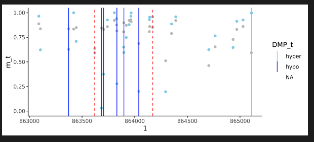

```{r, include = FALSE}
knitr::opts_chunk$set(
  collapse = TRUE,
  comment = "#>",
  eval = FALSE
)
```

This document describes experimental features of the CAMDAC package. These features are not yet fully tested and may change in future releases. The following features are currently under development for the **WGBS pipeline** only:

* Deconvolution only
* Using external copy number solutions
* Copy number calling in tumor-only mode
* Allele-specific methylation analysis
* Normal DNA methylation panels
* DMR visualisation

## Deconvolution only

The CAMDAC equation can be used to infer pure tumour DNA methylation rates, provided the following information is available per CpG:

* Bulk tumour methylation rate (CpG-wise)
* Tumour allele-specific copy number state (local region overlapping CpG)
* Tumour purity (single parameter per-sample)

Here is an example for 5 CpGs from a single sample. Note: the normal copy number state is assumed diploid (2) in humans:
```{r}

# Set parameters
bulk = c(0.3, 0.5, 0.2, 0.1, 0.9)
normal = c(0.3, 0.9, 0.1, 0.7, 0.5)
ploidy = c(2, 2, 1, 3, 4)
purity = 0.8

# Deconvolve methylation rates
pure_meth = CAMDAC:::calculate_mt(bulk, normal, purity, ploidy)

# Set clean rates based on threshold
pure_meth_clean = dplyr::case_when(
  pure_meth < 0 ~ 0,
  pure_meth > 1 ~ 1,
  TRUE ~ pure_meth
)

```

After deconvolution, it may be useful to estimate the CpG coverage in the deconvolved tumour sample. Additionally, the highest density interval (HDI) of the methylation rate may be informative for quality control. These metrics can be calculated given additional information on bulk methylated and unmethylated read counts:

```{r}

# Optional: calculate effective coverage of the tumour
# # Requires coverage per CpG in the bulk sample
bulk_coverage = c(10, 20, 5, 15, 30)
pure_effective_coverage = CAMDAC:::calculate_mt_cov(bulk_coverage, purity, ploidy)

# Optional: calculate the HDI of the pure tumour methylation rate
bulk_methylated_count = c(3, 10, 1, 2, 27)
bulk_unmethylated_count = c(7, 10, 4, 13, 3)
normal_methylated_count = c(3, 9, 1, 5, 2)
normal_unmethylated_count = c(7, 11, 3, 8, 3)

# HDI function (fast)
CAMDAC:::hdi_norm_approx(
  bulk_methylated_count,
  bulk_unmethylated_count,
  normal_methylated_count,
  normal_unmethylated_count,
  purity,
  ploidy
)

# HDI function (most accurate)
CAMDAC:::vec_HDIofMCMC_mt( 
  bulk_methylated_count,
  bulk_unmethylated_count,
  normal_methylated_count,
  normal_unmethylated_count,
  purity,
  ploidy,
  credMass=0.99
)
```


## Using external copy number solutions

The germline sample is optional as, in the absence of patient-matched methylation data, you may already have an allele-specific CNA solutions for your bulk tumor. For example, this could be derived from bulk WGS of the same sampl.

You can provide this data in tab-delimited text file as shown below. Importantly,:

- column names are optional
- purity and ploidy values are taken from the first data row alone
- chromosome names may be given with or without 'chr' prefix

| chrom | start | end | major_cn | minor_cn | purity | ploidy |
| --------- | ---- | ---- | ---- | ---- | ---- | ---- |
| chr1 | 1 | 400 | 2 | 1 | 0.67 | 3.5 |
| chr1 | 401 | 1000 | 1 | 1 | 0.67 | 3.5 |

To run CAMDAC with this CNA solution, pass attach the file to the tumor `CamSample()` object:

```{r add_cna}
library(CAMDAC)

# Load test data
b_tumor <- system.file("testdata", "tumor.bam", package = "CAMDAC")
b_normal <- system.file("testdata", "normal.bam", package = "CAMDAC")
cna_file <- system.file("testdata", "test.cna.txt", package = "CAMDAC")

# Set config
config <- CamConfig(outdir="./results", bsseq="wgbs", lib="pe", build="hg38", n_cores=10)

# Create tumor object and attach CNA solution
tumor <- CamSample(id="T", sex="XY", bam=b_tumor)
attach_output(tumor, config, "cna", cna_file)

# Define normal object(s) for deconvolution or differential methylation
normal <- CamSample(id="N", sex="XY", bam=b_normal)

# Run pipeline with CNA solution
pipeline(
    tumor=tumor,
    germline=NULL,
    infiltrates=normal,
    origin=normal,
    config=config
)
```

## Copy number calling in tumor-only mode

If no SNP file is present for the germline, CAMDAC will infer the copy number calls from the tumor sample alone. Here, the BAF is calculated by a threshold on the tumor BAF, and the LogR is calculated by taking the coverage relative to the median. These results are not as accurate as using a germline normal sample.

You may already know where heterozygous SNPs lie for your sample, obviating the need for a tumor BAF threshold. In addition, you may have a proxy of the normal coverage for your platform, which is an improvement over taking the tumor median. You can provide this information by attaching a SNPs file to the germline CamSample object. The file should contain:

| Field | Description |
| --- | --- |
| chrom | Chromosome name |
| POS | Position of SNP |
| BAF | (optional) B-allele frequency at this SNP |
| total_counts | (optional) Total number of reads at this SNP |

POS and total_counts are used to derive the BAF and the LogR respectively. We strongly recommend that total_counts is derived from a normal sample sequenced with the same bisulfite-sequencing assay as the tumor, and unmatched patient samples are acceptable.

CAMDAC may be run to the copy number calling stage using the external heterozygous SNP file:

```{r}
library(CAMDAC)

# Load test data
b_tumor <- system.file("testdata", "tumor.bam", package = "CAMDAC")
snps_file <- system.file("testdata", "test.to.norm_pos.csv.gz", package = "CAMDAC")

# Set config
config <- CamConfig(outdir="./results", bsseq="wgbs", lib="pe", build="hg38", n_cores=10)

# Create tumor object and attach CNA solution
tumor <- CamSample(id="T", sex="XY", bam=b_tumor)
attach_output(tumor, config, "cna", cna_file)

# Define normal object(s) for deconvolution or differential methylation
germline <- CamSample(id="G", sex="XY")
attach_output(germline, config, "snps", snps_file)

# Run pipeline with CNA solution
pipeline(
    tumor=tumor,
    germline=germline,
    infiltrates=NULL,
    origin=NULL,
    config=config
)

```

After this, we recommend inspecting the CNA results. If all is well, the pipeline() function can be repeated with the infiltrates and origin CamSamples to complete deconvolution and differential methylation respectively.

## Allele-specific methylation (ASM) analysis

CAMDAC can be used to detect allele-specific methylation (ASM) by phasing CpGs to heterozygous SNPs and deconvolving bulk methylation rates per allele. 

This tutorial steps through the ASM analysis pipeline (WGBS only):

1. Count CpG methylation on tumor and normal at sites phased to SNP loci.
2. Deconvolve methylation on tumor **per haplotype** using the normal
3. Assign allele-specific copy number state **per CpG** using the bulk tumor solution
4. Call allele-specific differential methylation within samples
5. Call allele-specific differential methylation between samples

Results from this pipeline are found in the results directory under 'PATIENT/AlleleSpecific' and 'PATIENT/Methylation'. See output file headings below for files and their content.

### CAMDAC-ASM from BAM files

The `asm_pipeline()` function runs CAMDAC-ASM analysis by generates the allele-specific copy number solution and heterozygous SNP loci, followed by deconvolution and differential ASM analysis:

```{r}
b_tumor <- system.file("testdata", "tumor.bam", package = "CAMDAC")
b_normal <- system.file("testdata", "normal.bam", package = "CAMDAC")
regions <- system.file("testdata", "test_wgbs_segments.bed", package = "CAMDAC") # speed up tests

tumor <- CamSample(id = "T", sex = "XY", bam = b_tumor)
normal <- CamSample(id = "N", sex = "XY", bam = b_normal)
config <- CamConfig(
  outdir = "./results", ref = "./pipeline_files", bsseq = "wgbs", lib = "pe", cores = 10,
  min_cov = 1, # For test data
  regions = regions
)

asm_pipeline(
  tumor = tumor,
  germline = normal,
  infiltrates = normal,
  origin = normal,
  config = config
)
```


### CAMDAC-ASM from external inputs (in_development)

To run the ASM pipeline without BAM files, CAMDAC requires:
- Each CamSample object has SNP loci
- The tumor CamSample object has an allele-specific CNA solution
- All CamSample objects have BAM files available for phasing

CAMDAC-ASM requires a file of heterozygous SNP loci against which CpGs will be phased. This is a tab-delimited file with a header containing four fields:

| Field | Description |
| ---- | ------------ |
| chrom | Chromosome name |
| pos | SNP loci position |
| ref | The reference allele (A/C/T/G) |
| alt | The alternate SNP allele (A/C/T/G) | 

First, attach your SNP loci file to the tumor object with `attach_output()`, then run `asm_pipeline()`:
```{r}
# Setup CAMDAC samples
tumor <- CamSample(id = "tumor", sex = "XY", bam = b_tumor)
normal <- CamSample(id = "normal", sex = "XY", bam = b_normal)
config <- CamConfig(
  outdir = "./results", ref = "./pipeline_files", bsseq = "wgbs", lib = "pe", cores = 10,
  min_cov = 1, # For test data
  regions = regions
) # For arapid testing)

# Add SNPs
asm_snps_file <- system.file("testdata", "test_het_snps.tsv", package = "CAMDAC")
attach_output(tumor, config, "asm_snps", asm_snps_file)
attach_output(normal, config, "asm_snps", asm_snps_file)
```

Next, CAMDAC requires the allele-specific copy number solution from the tumor, attached as follows:
```{r}
cna_file <- system.file("testdata", "test_cna.tsv", package = "CAMDAC")
attach_output(tumor, config, "cna", cna_file)
```

Finally, run the allele-specific methylation pipeline:
```{r}
asm_pipeline(
  tumor = tumor,
  infiltrates = normal,
  origin = normal,
  config = config
)
```

### CAMDAC-ASM using SNP calls from previous CAMDAC runs

If you have already run the CAMDAC pipeline in tumor-normal mode, then the germline object's SNP files will be used by default. The simplest run from BAM to ASM is shown below using matched normals for infiltrates and DMPs:

```{r}
b_tumor <- system.file("testdata", "tumor.bam", package = "CAMDAC")
b_normal <- system.file("testdata", "normal.bam", package = "CAMDAC")
regions <- system.file("testdata", "test_wgbs_segments.bed", package = "CAMDAC") # speed up tests

tumor <- CamSample(id = "T", sex = "XY", bam = b_tumor)
normal <- CamSample(id = "N", sex = "XY", bam = b_normal)
config <- CamConfig(
  outdir = "./test_results", bsseq = "wgbs", lib = "pe",
  build = "hg38", n_cores = 10,
  regions = regions,
  min_cov = 1, # For test data
  cna_caller = "ascat" # Battenberg always recommended, however ASCAT used here for rapid testing.
)

# Run main CAMDAC generate SNP files for ASM
# Deconvolution skipped here for simplicity.
pipeline(tumor, germline = normal, infiltrates = NULL, origin = NULL, config)

# Run ASM pipeline
asm_pipeline(
  tumor = tumor,
  germline = normal,
  infiltrates = normal,
  origin = normal,
  config = config
)
```

### ASM output file headings

** Allele-specific/ **

- *asm_counts.csv.gz - The number of reads supporting each allele at each CpG
- *asm_hap_stats.csv.gz - Summary statistics for each phased SNP
- *asm_phase_map.csv.gz - A mapping of CpG-SNP phased pairs per read
- *snps.txt - The heterozygous SNP loci input for ASM analysis 
- *cna.csv - For the tumour, the allele-specific copy number profile. See format in `vignettes("pipeline")`.

** Methylation/ **

- *asm_meth.csv.gz - Allele-specific methylation rates for bulk samples
- *asm_ss_dmp.csv.gz - Single sample differential allele-specific methylation
- *asm_meth_cna.csv.gz - For the tumour, ASM rates with annotated copy number states
- *asm_meth_pure.csv.gz - For the tumour, pure methylation rates for each allele
- *asm_dmp.csv.gz - Differential allele-specific methylation between tumor and origin sample

## Normal DNA methylation panels

This feature is currently described for CAMDAC-WGBS only.

### Create a methylation panel from multiple normal BAM files

CAMDAC supports the use of multiple DNA methylation BAM files as a source of the normal infiltrates or normal cell of origin.

To create a panel, process your BAM files with the CAMDAC allele counter:

```
library(CAMDAC)

# Get BAM files
b_normal1 = system.file("inst/testdata/normal.bam")
b_normal2 = system.file("inst/testdata/normal.bam")
b_normal3 = system.file("inst/testdata/normal.bam")

# Run allele counter
for(file in c(b_normal1, b_normal2, b_normal3)){
    prefix = fs::path_ext_remove(file)
    outfile = paste0(prefix, ".all.SNPs.CG.csv.gz")
    data = cmain_count_alleles(bam_file)
    data.table::fwrite(data, outfile)
}
```

The allele counts files can then be merged into a single file for the panel containing methylation data for deconvolution:

```{r}
panel_counts <- fs::dir_ls(".", glob="*.SNPs.CG.csv.gz")
panel <- panel_meth_from_counts(panel_counts)
data.table::fwrite(panel, "panel.m.csv.gz")
```

By default, panel counts are merged by summing the methylation read counts for each CpG site. You can customise the proportion of each sample that is used in the panel by specifying the `ac_props` argument in panel_meth_from_counts. To get the mean across each CpG site, simply pass equal proportions for each sample.

To run CAMDAC with your newly created panel, attach your panel to a CamSample object using the `meth` argument.

```{r}
# Load test data
b_tumor <- system.file("testdata", "tumor.bam", package = "CAMDAC")
b_normal <- system.file("testdata", "normal.bam", package = "CAMDAC")

# Setup CAMDAC samples
tumor <- CamSample(id="tumor", sex="XY", bam=b_tumor)
normal <- CamSample(id="normal", sex="XY", bam=b_normal)
config <- CamConfig(outdir="./results", ref="./pipeline_files", bsseq="wgbs", lib="pe", cores=10)

# Setup panel sample
panel <- CamSample(id="panel", sex="XY")
panel_file <- system.file("testdata", "test_panel.m.csv.gz", package = "CAMDAC")
attach_output(panel, config, "meth", panel_file)

# Run CAMDAC with panel
pipeline(
    tumor=tumor,
    germline=normal,
    infiltrates=panel,
    origin=panel,
    config=config
)
```

### Create a methylation panel from a matrix of beta values

If you have not started from BAM files, you can create a panel using a matrix of beta values:

| sample1 | sample2 | sample3 |
|---------|---------|---------|
| 0.5     | 0.6     | 0.7     |
| 0.4     | 0.5     | 0.6     |

Additionally, a data frame specifying the positions of each CpG site in the beta value matrix is required. Here, start and end refer to the C and G of the CpG site respectively:

| chrom | start | end |
|-------|-------|-----|
| chr1  | 100   | 101 |
| chr1  | 200   | 201 |

The matrix and CpG locations can be passed directly to the `panel_meth_from_beta()` function, along with settings.

```{r}
# Load beta values and chromosome positions
ex <- system.file("testdata", "test_panel_from_beta.csv", package = "CAMDAC")
data <- data.table::fread(ex)
mat = data[, 4:ncol(data)] # Beta value matrix with 3 samples

# Create panel from beta values
panel_beta <- panel_meth_from_beta(
  mat = mat,
  chrom = data$chrom,
  start = data$start,
  end = data$end, 
  cov = 100,
  props = c(0.1, 0.8, 0.1), # Proportions of each sample in panel
  min_samples = 1,
  max_sd = 1
)
```

As CAMDAC requires coverage at each CpG site to estimate uncertainty, the `cov` value is given to all CpG sites when building a panel from beta values. Additionally, if any beta values are missing from a sample, proportions are recalculated among the remaining samples as this is the only information available to build the panel for that site.

There are two experimental arguments that can be set to filter CpG sites from the panel:

* min_samples: The minimum number of samples that have to have a beta value for a CpG to be included in the panel. The idea here is if you have sparse data, you can skip sites where you aren’t confident in the panel. Set this to 1 to use any sample.

* max_sd: Maximum standard deviation of beta values across samples a CpG must have to be included in the panel. The idea here is that when combining many bulk methylomes from the same tissue, sites with high variability reflect sample-specific differences and their averages are less reliable for use in a methylation panel.

## DMR visualisation

CAMDAC produces several output files that visualise the copy number state.  DNA methylation rates can be passed to external packages for visualisation. For a quick view of DMRs in R:

```{r}
library(data.table)
library(ggplot2)
library(CAMDAC)

# Show DMPs around a region
dmr <- data.table(dmr) # Object from CAMDAC output *annotated_DMRs.fst
dmp <- data.table(dmp) # Object from CAMDAC *results_per_CpG.fst
chrome <- dmr[1, ]$chrom
starte <- dmr[1, ]$start
ende <- dmr[1, ]$end
offset <- 1000 # Offset 1kB either side of region
dmp <- data.table(dmp)
dm_regions <- dmp[chrom == as.character(chrome) & start >= (starte - offset) & end <= (ende + offset), ]

# Using ggplot, generate a geom where the m_t values are
tplt <- ggplot(dm_regions, aes(x = start)) +
  geom_point(aes(y = m_t), color = "skyblue") +
  geom_point(aes(y = m_n), color = "grey") +
  geom_vline(aes(xintercept = start, color = DMP_t)) +
  theme_classic() +
  scale_color_manual(values = c("skyblue", "blue")) +
  scale_y_continuous(limits = c(0, 1)) +
  geom_vline(xintercept = c(start, end), color = "red", linetype = "dashed") +
  labs(x = dm_regions$chrom[[1]])
tplt
```



Here, light blue dots are the pure tumour, while light-grey are the normal. The red dash is the DMR region and the vertical lines are hypomethylated DMPs (blue) and hypermethylated DMPs (light blue).