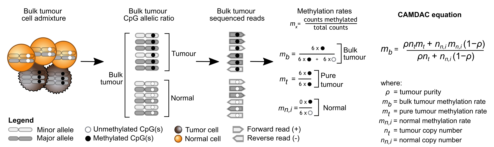
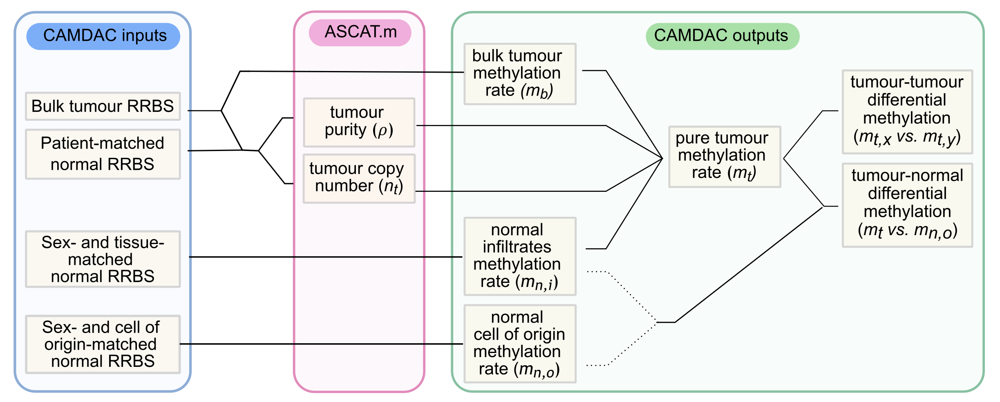

### Introduction  

Solid tumours typically contain both cancer and admixed normal contaminating cells, which confounds the analysis of bulk cancer methylomes from bisulfite sequencing. To address these issues we present CAMDAC, our tool for **C**opy-number **A**ware **M**ethylation **D**econvolution **A**nalysis of **C**ancer.

In brief, we show that the bulk tumour methylation rate, $m_b$, can be expressed as a tumour purity and copy number weighted sum of the methylation rates of the tumour cells and normal contaminants (**Figure 1**). We derive purity and copy numbers directly from bulk tumour RRBS data leveraging somatic copy number aberration calls from ASCAT or Battenberg. We use bulk tissue- and sex-matched normal samples as proxy for the normal tumour-infiltrating cells, $m_{n,i}$, and obtain $m_b$ from the bulk tumour data itself. This provides all the necessary information to extract the pure tumour methylation rate, $m_t$.

{width=85%}

  In [Larose Cadieux *et al.*, 2020](https://doi.org/10.1101/2020.11.03.366252)^1^, we obtained bulk tumour RRBS data from surgically resected lung cancers as well as patient-matched tumour-adjacent normal lung samples. These normals were used for copy number profiling as well as proxy for both the normal tumour-infiltrating cells, $m_{n,i}$, and the tumour cell of origin, $m_{n,o}$. A substitute for $m_{n,i}$ is needed for bulk tumour methylation rate deconvolution and $m_{n,o}$ is required for differential methylation analyses (**Figure 2**). In non-small cell lung cancer, we showed that the patient-matched tumour-adjacent normal is a suitable proxy for all normals, i.e. $m_{n,i} \approx m_{n,o}$ [(Larose Cadieux et *al.*, 2020)](https://doi.org/10.1101/2020.11.03.366252)^1^.

{width=85%}  

  If the patient-matched tumour-adjacent normal tissue is not available, a tissue- and sex-matched normal may provide a suitable substitute for the tumour-infiltrating normal cells (**Figure 2**). If the tissue-matched normal is a poor representative of the cell of origin, a different proxy may be used for differential methylation analysis.

The purified tumour methylation rates allow for accurate quantification of differential methylation, both between tumour and normal cells and, in the case of multi-region sequencing, between different tumour samples. The deconvoluted methylation profiles accurately inform inter- and intra-tumour sample relationships and could enable timing of copy number gains and (epi)mutations in tumour evolution. This is explained in more details in [Larose Cadieux et *al.*, 2020](https://doi.org/10.1101/2020.11.03.366252)^1^.  

At time of writing, CAMDAC is compatible with human *Msp1* digested single-end directional reduced representation bisulfite sequencing (RRBS) data and whole genome bisulfite sequencing (WGBS) data. The input must be in binary alignment map (BAM) format. Bases should be quality and adapter trimmed and PCR duplicates should be removed. BAM files may be aligned to hg19, hg38, GRCH37 and GRHCH38 reference human genome builds.   

### References

[^1]: Larose Cadieux *et al.* (2020). Copy number-aware deconvolution of tumor-normal DNA methylation profiles, bioRxiv 2020.11.03.366252