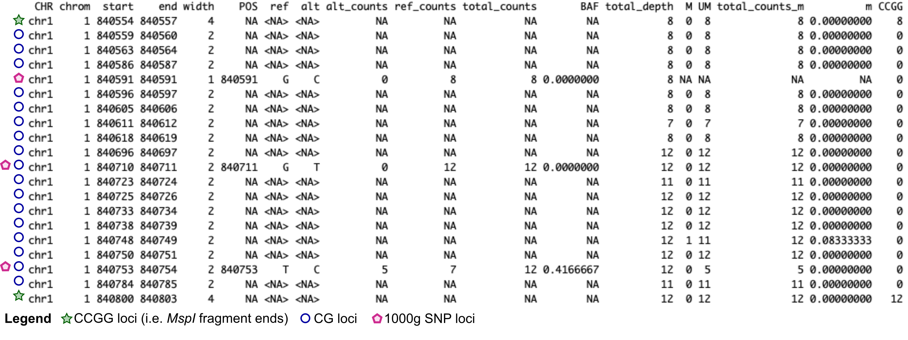
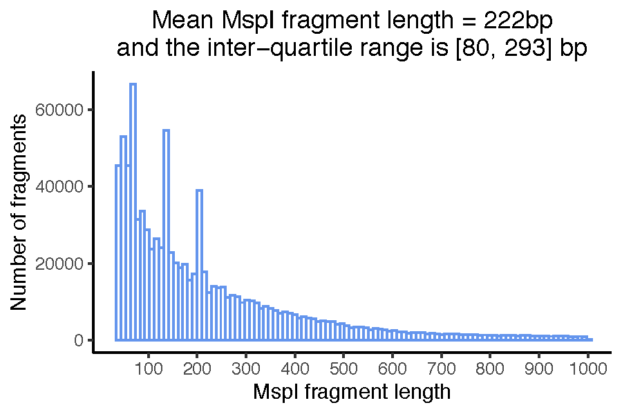
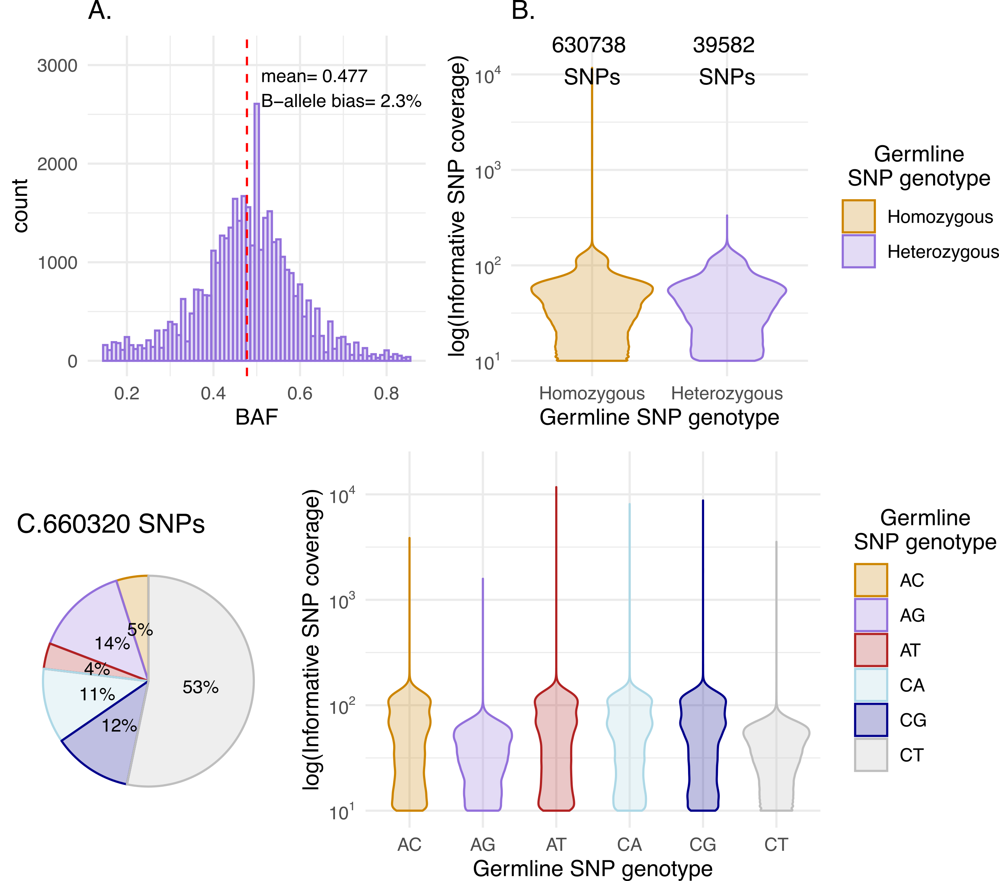
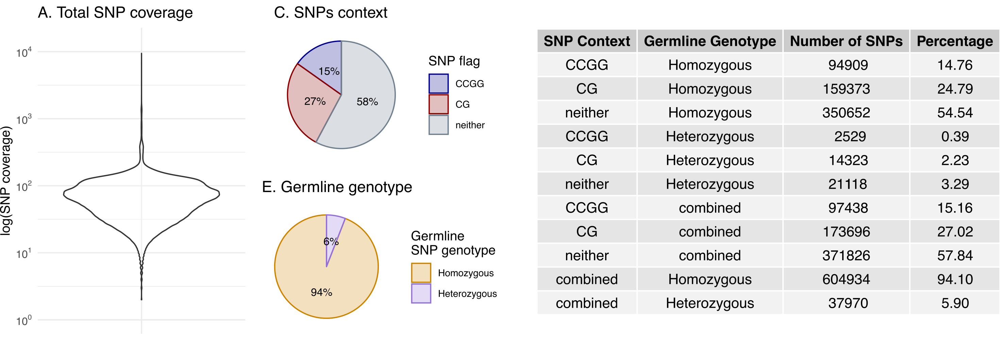
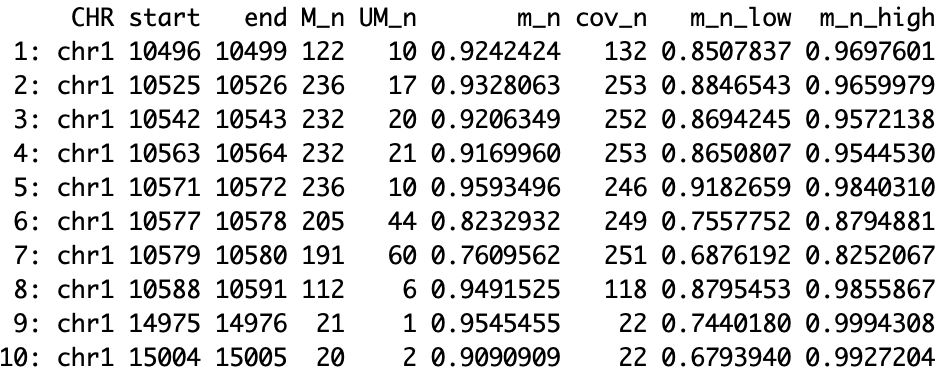
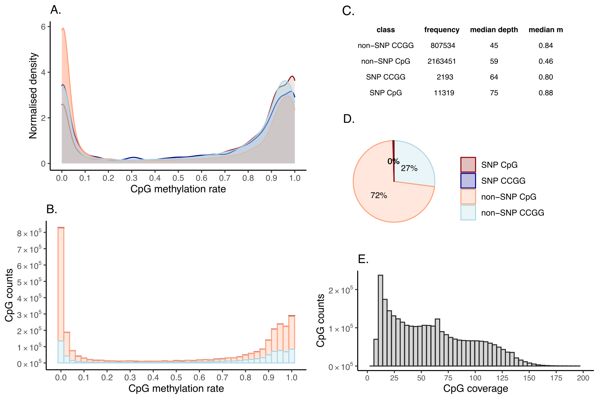
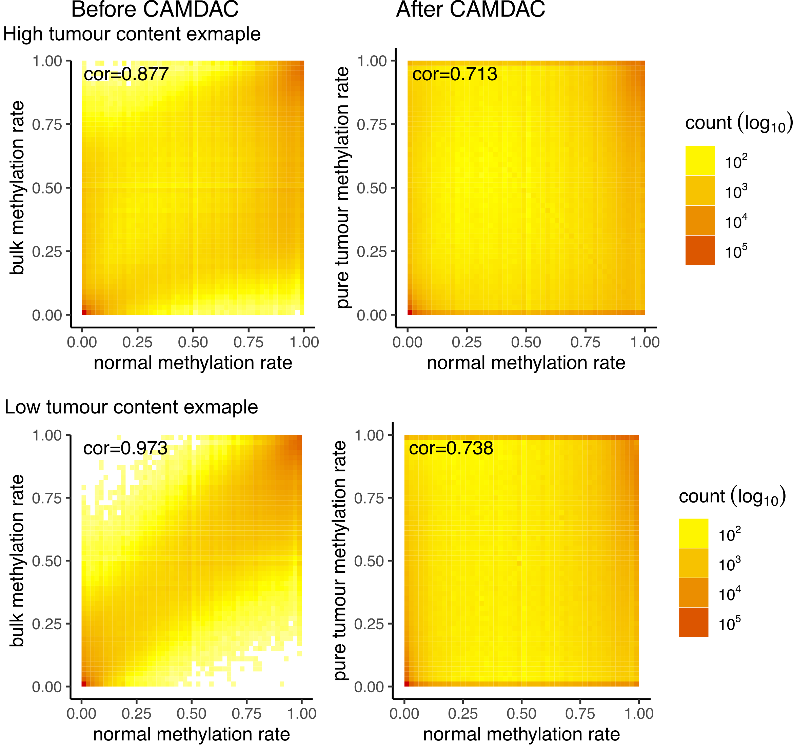
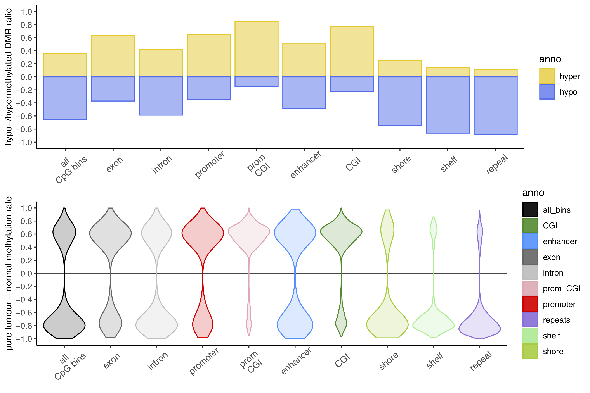

  In this section, we provide a high-level summary of the CAMDAC pipeline, which covers six key steps:

1. **Allele Counting**: Obtain allele counts at SNP and CpG loci.  
2. **Copy-number calling**: Obtain allele-specific copy number profiles, tumour purity and SNP plot data.
3. **Methylation Processing**: Filter, format and plot methylation data.
4. **Deconvolution**: Deconvolve the pure tumour methylation rates from bulk tumour RRBS data.
5. **Differential methylation**: Perform differential tumour-normal methylation analysis.

For a full outline and validation of CAMDAC, please see Larose Cadieux _et al_. (2020) _bioRxiv_.

## Allele counting

Take a hypothetical female patient with primary tumour sample ID "**T1**" and normal-adjacent sample ID "**N1**". First, CAMDAC takes the sequencing alignment files from each sample using the `CamSample()` functions, users should provide the full path and file name for the RRBS or WGBS binary mapping alignments (.bam) files for input samples, and use the `CamConfig()` sample to indicate whether they are aligned hg19, hg38, GRCH37 or GRCH38. Bases should be quality and adapter trimmed and PCR duplicates should be removed. Please ensure that the bam file is sorted and indexed.

CAMDAC employs an allele counter module to count SNP and CpG (methylation) alleles for downstream analysis. SNP counts are performed at 1000 genome SNP positions, and CpG alleles are counted using dinucleotides. To speed up the computation, we leverage a reference RRBS and WGBS genome files listing all genomic regions supported by the respective platforms. 

By default, the read mapping quality filter is set to **mq**>=0 as default in `CamConfig()`. Mapping quality scores from bisulfite sequencing aligners may be biased against the alternate allele for reads with polymorphisms. Please review the mapping quality distribution of your data to determine if it is appropriate to increase this setting.

If the function is successful, a signle file output with the suffix "SNPs.CpGs". This file carries compiled SNP and methylation information with the following columns:  

Each row is either a CG locus (and CCGG for RRBS) and/or a 1000g SNP position. These can be distinguished by the *width* column. While polymorphic CG/CCGG have the same width as their non-polymorphic counterpart, they are easily identified by looking at the *POS*, *ref*, *alt* and other SNP-informative columns.

For each SNP locus, 1000 Genomes genomic coordinate and reference and alternate alleles are listed under *POS*, *ref* and *alt* columns. The *total_counts* is the sum of *alt_counts* and *ref_counts*, which including all informative strand-specific allele counts. For example, at $C>T$ SNPs, only the reverse strand allows to distinguish between the (un)methylated reference and the alternate allele and thus all forward read counts would be excluded from the *total_counts* column, but included in the *total_depth*. The SNP *type* column is only added to the patient-matched normal, which is used to assign SNP genotypes as either Homozygous or Heterozygous based on internal B-allele frequency (BAF) cut-offs.

*M*, *UM*, *total_counts_m*, and *m* are the counts methylated, counts unmethylated, the total counts (un)methylated and the methylation rate, respectively. Methylation rates are calculated per CG allele, meaning that at polymorphic CpGs, only the CG-forming allele counts are considered. CAMDAC methylation rates are therefore polymorphism-independent.

For CCGG loci found in RRBS, the *CCGG* column indicates the number of fragments with a 5' end at this CCGG loci. This number may be 0 at polymorphic CCGG loci homozygous for the CCGG-destroying allele. Furthermore, for RRBS, *MspI* fragment boundaries are determined from the aligned reads and *MspI* fragment the size distribution is visualised for quality assessment in the file *fragment_length_histogram.pdf*. You should observe 3 disctinct peaks in the fragment length distribution. This is characteristic of human RRBS libraries and originates from *MspI* containing micro-satellite repeats of distinct lengths. The *MspI* fragment boundaries and their GC content are saved as an .RData object and used downstream in RRBS copy number profiling.

{width=50%}  

 

## Copy number calling

B-allele frequencies at heterozygous SNPs are leveraged to calculate pure tumour copy number aberrations using either ASCAT.m for RRBS or Battenberg.m for WGBS. These tools are inspired from ASCAT ([Van Loo *et al.*, 2010](https://doi.org/10.1073/pnas.1009843107)) and Battenberg ([Nik-Zainal *et al.*, 2012](https://www.cell.com/cell/fulltext/S0092-8674(12)00527-2)). If sucessful, CAMDAC writes copy number output to the "Copy_number" directory.

A SNPs file lists the heterozygous SNPs selected for copy number analysis, resulting in a table where each row is a 1000g SNP position with minimum coverage defined by the `germline` sample with a minimum coverage set by the **min_normal** argument. The *total_counts* column is the total informative read counts. For example, at C$>$T SNPs, only the reverse strand allows to distinguish between the unmethylated reference and the alternate allele and thus, forward read counts would not contribute to the *total_counts* and the *BAF* (B-allele frequency calculation). *rBAF* is randomly assigned *BAF* or 1-*BAF* to remove biases against the alternate allele in downstream tumour copy number profiling. All read counts however contribute to the *total_depth* which is used for LogR calculation, a measure of total coverage. Genotyping is performed and assignments stored under *type*.

For the RRBS pipeline, we provide an experimental feature to visualise the magnitude of biases against alternate of (B)-alleles. The number of homozygous to heterozygous SNPs is depicted and any biases in coverage against the latter can be evaluated. Due to being biases for CpG-rich genomic regions, a typical RRBS sample should show a high ratio of C$>$T SNPs. We note that C$>$T and A$>$G germline heterozygous SNPs will have roughly half the coverage of the 4 types of SNPs.

{width=65%}

 

In addition to the above-mentionned columns, we also adjust for biases in the tumour LogR. The LogR is a normalised measure of tumour coverage used by ASCAT.m and Battenberg.m for copy number profiling together with the BAF. The covariates used for LogR correction are:

- *GC_content*: The GC content of fragments leads to sequencing biases, namely at the PCR amplification step.
- *replic*: The local genomic replication timing affects the number of copies present at a given locus in cells undergoing S phase.
- *msp1_length*: RRBS only. The *MspI* fragment length is highly variable and we observe sequencing biases against fragments at the extremes of the fragment size distribution.

Next, the standard ASCAT or Battenberg output are then generated. All files have the dot-separated patient and sample IDs as prefix. In addition, we plot the BAF and LogR. In the BAF profiles, heterozygous SNPs are highlighted in red. The BAF and LogR tracks are then segmented by the respective tools. The segmentation is then analysed to determine the optimal tumour purity and ploidy solution via a grid search (see sunrise plot). Raw and rounded allele-specific copy number segments are provided as output png images.

Finally, the purity, ploidy, number of heterozygous and homozygous 1000g SNP positions and median tumour and normal SNP depth are saved for each tumour sample. For RRBS, summary SNP data is plotted and saved as a pdf with filename "*_SNP_data.pdf*" and may help you troubleshoot your data.

{width=90%}

 

## Methylation processing

As part of the allele counting step, CAMDAC calculates bulk DNA methylation rates for each input sample. For the patient- and tissue-matched normal sample "N1", the methylation data columns have the suffix is $x = n$, since $m_{n,i} \sim m_{n,o}$. Where $m_{n,i} \neq m_{n,o}$, the suffix is set to $x = n\_i$ for the normal infiltrates and $x = n\_o$ for the normal cell of origin proxy sample. The uncertainty on $m_{x}$ is computed as the lower and upper boundaries of the 99% Highest Density Interval (HDI) are stored under columns  $m_{x,low}$ and $m_{x,high}$.

- *CHR*: Chromosome name with 'chr' prefix
- *start*: First base of CG/CCGG
- *end*: Last base of CG/CCGG
- *M_x*: Counts methylated
- *UM_x*: Counts unmethylated
- *m_x*: Methylation rate
- *m_x_low*: Lower boundary of the 99% HDI for $m_{x}$
- *m_x_high*: Upper boundary of the 99% HDI for $m_{x}$

{width=50%}

In the normal sample methylation output directory, you will find a pdf with methylation data summary and QC (RRBS only). We expect DNA methylation rates to sit near 0 and 1. CAMDAC calculates DNA methylation rates in a polymorphism-independent manner, meaning that the CG-destroying allele at a heterozygous CpG does not contribute to its methylation rate. The minimum coverage threshold applied to CpG sites is based on the CpG allele read depth, so any heterozygous SNPs present at the CG location may be removed due to insufficient coverage.

{width=90%}

 

## Deconvolution

At this stage, CAMDAC has obtained methylation rates for both the normal infiltrates and bulk tumour, as well as tumour copy number and purity estimates. The DNA methylation profile of the normal-adjacent samples may be used as a proxy for the methylation rate of tumour-infiltrating normal cells ($m_{n,i}$). We have all the necessary information to obtain CAMDAC pure tumour methylation rates, $m_t$.

In the Methylation/ output directory, CpG copy number and purified tumour methylation data are written to output CSV files. Header fields include:

- *nA*: Major allele copy number
- *nB*: Minor allele copy number
- *CN*: Total allele copy number
- *seg_start*: Copy number segment start point
- *seg_end*: Copy number segment end point
- *CG_CN*: CpG allele total copy number
(this differ from *CN* at polymorphic CpGs)
- *m_t_raw*: Raw CAMDAC purified tumour methylation rate
- *m_t_corr*: Corrected CAMDAC purified tumour methylation rate
- *cov_t*: CAMDAC purified tumour effective read coverage
- *m_t_low*: CAMDAC purified tumour 99% HDI lower boundary
- *m_t_high*: CAMDAC purified tumour 99% HDI upper boundary

CAMDAC-deconvoluted methylation rate can have any values between 0 and 1 while the range of bulk tumour methylation rates is driven by tumour DNA content. In the bulk tumour profiles, bi-allelic tumour-normal differentially methylated positions appear at intermediate methylation values while after purification, they form a peak near 0 or 1 for hypo- and hypermethylated positions, respectively.   

{width=60%}

 

## Differential methylation

For tumour-normal differential methylation analysis, CAMDAC expects a DNA methylation profile representing the tumour cell of origin ($m_{n,o}$). In this hypothetical example, we set the normal sample **N1** as the cell of origin. Leveraging CAMDAC purified methylomes, we then obtain differentially methylated positions and regions.

Differential DNA methylation is detected with a minimum tumour-normal methylation rate difference (effect size, where $\delta\beta$ >= 0.2) and a probability threshold, representing the probability that the tumour and normal beta distributions do not overlap. Both variables are used for calling differentially methylated positions (DMPs). 

Next, CAMDAC builds on DMP calls to call DMRs. To identify differentially methylated regions (DMRs), we group CpGs into bins and look for clusters with at least 5 DMPs (**min_DMP_counts_in_DMR**=5), 4 of which must be consecutive (**min_consec_DMP_in_DMR**=4). After completion, this function generates a pure tumor methylation file (*CAMDAC_results_per_CpG.RData for RRBS or *pure.csv.gz for WGBS) in the CAMDAC methylation output directory. This R object is a combination of all CAMDAC results per CpG with DMP information included:
 
- *cluster_id*: RRBS CpG cluster
- *chrom*: Chromsome name (i.e. 1, 2, ..., X)
- *start*: First base of CG/CCGG
- *end*: Last base of CG/CCGG
- *m_n*: normal methylation rate
- *m_n_low*: normal methylation rate HDI99 lower boundary
- *m_n_high*: normal methylation rate HDI99 upper boundary
- *m_t*: CAMDAC pure tumour methylation rate
- *m_t_low*: CAMDAC pure tumour methylation rate HDI99 lower boundary
- *m_t_high*: CAMDAC pure tumour methylation rate HDI99 upper boundary
- *prob*: Tumour-noraml DMP probability
- *CG_CN*: CpG allele total copy number
- *nA*: Major allele copy number
- *nB*: Minor allele copy number
- *segment*: Copy number segment endpoints
- *DMR_type*: "hyper", "hypo" or "mixed"
- *CpG_counts*: Number of CpGs in a given bin
- *DMP_counts*: Number of DMPs
- *consec_DMPs*: Number of consecutive DMPs
- *DMR*: "DMR" if differentially methylated, NA otherwise.
- *m_diff_tn*: CAMDAC-purified tumour $-$ normal methylation rates
- *prob_DMP*: DMP probability
- *DMP_t*: DMP calls based on CAMDAC-purified tumour *versus* normal methylation rates

The ratio of hyper- to hypomethylated DMRs varies across genomic regions is reflected by the tumour-normal methylation rate difference.

{width=80%}

 

### Leveraging CAMDAC outputs

CAMDAC outputs will be stored at the user-defined project `outdir` variable given to the configuration (`CamConfig()`). A patient folder is created at this path with directory name set to **patient_id**. This will contain 3 subdirectories: Allelecounts, Copy_number and Methylation, with further sub-directories created for each of a given patient's samples.

With CAMDAC differential methylation calls in hand, users may choose to look for recurrently aberrated loci across their cohort. Note that tumour-tumour DMPs can be easily identified by looking for overlap between the 99% HDIs for CAMDAC pure tumour methylation rates between samples (99% HDI $\subseteq$ [**m_t_low**,**m_t_high**]).

Clustering* analyses can also easily be performed by the user using well-established R packages such as 'pvclust' for hierarchical clustering with bootstrap and 'umap' (uniform manifold approximation and projection) for non-linear dimensionality reduction. Clustering of pure tumour methylation rates at promoter DMRs across large cohorts by 'umap' may reveal histology and/or sex-driven clusters as described in non-small cell lung cancer [Larose Cadieux et *al.*, 2020](https://doi.org/10.1101/2020.11.03.366252)^1^.

For multi-region data, sample tree reconstruction by neighbour joining leveraging CAMDAC pure tumour methylation rates at hypermethylated DMPs in at least on sample, subset to loci confidently unmethylated in the normal cell of origin (**m_n_high**<0.2), can reveal inter-sample relationships, as demonstrated in non-small cell lung cancer [Larose Cadieux et *al.*, 2020](https://doi.org/10.1101/2020.11.03.366252)^1^.

When running gene-set enrichment analysis (*GSEA*) on CAMDAC DMR calls, gene sets should be limited to those genes with promoters covered by RRBS. It may be desirable to subset DMR calls to hypermethylated promoter-associated CpG Islands given that methylation at these loci is most correlated with expression.

Users may leverage normal, deconvoluted tumour methylation rates and tumour-normal DMP calls to separate clonal mono- and bi-allelic from subclonal bi-allelic methylation changes to shed light into tumour evolutionary histories [Larose Cadieux et *al.*, 2020](https://doi.org/10.1101/2020.11.03.366252)^1^. The allele-specific CAMDAC module will be made available in future releases.

### References

Larose Cadieux *et al.* (2020). Copy number-aware deconvolution of tumor-normal DNA methylation profiles, bioRxiv 2020.11.03.366252