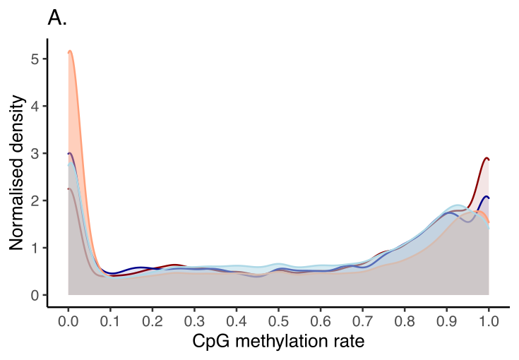

# Technical Notes

<br/> In this section, we provide a high-level summary of the CAMDAC pipeline. There are six key steps:

1. **Allele Counting**: Obtain allele counts at SNP and CpG loci.  
2. **Copy-number calling**: Obtain allele-specific copy number profiles, tumour purity and SNP plot data.
3. **Methylation Processing**: Filter, format and plot methylation data.
4. **Deconvolution**: Deconvolve the pure tumour methylation rates from bulk tumour RRBS data.
5. **Differential methylation analysis**: Perform differential tumour-normal methylation analysis.

Take a hypothetical female patient with primary tumour sample ID "**T1**" and normal sample ID "**N1**". First, CAMDAC takes the BAM files from each sample and counts SNP and CpG (methylation) alleles. The orientation-aware counter ensures that SNP and CpG sites are accurately measured. 

B-allele frequencies at heterozygous SNPs are leveraged to calculate pure tumour copy number aberrations using either ASCAT.m for RRBS or Battenberg.m for WGBS.

ASCAT.m, our tool for allele-specific copy number profiling, is integrated within CAMDAC module 3, **run_ASCAT.m**. ASCAT.m requires patient-matched normal RRBS data. The patient-matched normal RRBS data should be processed *before* the tumour samples from the same patient setting **sample_id**=**patient_matched_normal_id**. If a patient-matched normal is not available, you must set this variable to NULL (default = NULL) and provide the **reference_panel_coverage** variable (see details under *Step 3* below).

A normal proxy for the methylation rate of the tumour-infiltrating normal cells, **normal_infiltrates_proxy_id** ($m_{n,i}$), is required for tumour-normal deconvolution. We also need a best guess substitute for the tumour cell of origin, **normal_origin_proxy_id** ($m_{n,o}$), which will be used tumour-normal differential methylation analysis. In this hypothetical example, we set both the normal infiltrates and the normal cell of origin to a patient-matched adjacent normal sample with **sample_id**="N1".


CAMDAC outputs will be stored at the user-defined project **path** variable. A patient folder is created at this path with directory name set to **patient_id**. This will contain 3 subdirectories: Allelecounts, Copy_Number and Methylation. Within these 3 results folders, a directory is created for each of a given patient's samples. In this example, a folder for each 'N1' and 'T1' would be generated. Users should also provide a character string pointing to the CAMDAC installation path in the **path_to_CAMDAC** variable.


Finally, users should provide the full path and file name for the RRBS binary mapping alignments (.bam) file for this sample, indicating whether it is aligned to either hg19, hg38, GRCH37 or GRCH38. Bases should be quality and adapter trimmed and PCR duplicates should be removed. Please ensure that the bam file is sorted and indexed.


#### Step 1: Obtain allele counts at SNP and CpG loci

The first step is to obtain dinucleotide read counts are CpGs and single nucleotide counts at 1000 genome SNP positions[^2]. CpG loci created by SNP positions are also included. If you are unsure of the reference genome build of your BAM file, but know it is either 'hg19', 'hg38', 'GRCH37' or 'GRHCH38', input **build=NULL** and let CAMDAC determine the build version for you.

To speed up the computation, we built a reference RRBS genome listing all genomic regions supported by $\geq$5 reads in $\geq$1 of in a panel of normal lung tissue with NuGEN *MspI* digested RRBS[^3],[^4] data. This step greatly reduces the number of loci to investigate since RRBS data only covers about 2% of the human genome. Reference loci files are divided into 25 smaller files to reduce memory requirements. The '**get_allele_counts**' function is run within a loop whereby the i^th^ iteration of the function pulls the corresponding i^th^ reference file. We recommend running this function as a simple for loop as it is internally parrallelised by **n_cores**.

Note that read mapping quality threshold is set to **mq**=0. This is important so as not to create bias against the alternate allele for reads with polymorphisms. RRBS alignments are validated based on read start sites as opposed to mapping quality. This flag will become relevant in future CAMDAC versions compatible with WGBS data.


#### Step 1: Obtain allele counts at SNP and CpG loci

The first step is to obtain dinucleotide read counts are CpGs and single nucleotide counts at 1000 genome SNP positions[^2]. CpG loci created by SNP positions are also included. If you are unsure of the reference genome build of your BAM file, but know it is either 'hg19', 'hg38', 'GRCH37' or 'GRHCH38', input **build=NULL** and let CAMDAC determine the build version for you.

To speed up the computation, we built a reference RRBS genome listing all genomic regions supported by $\geq$5 reads in $\geq$1 of in a panel of normal lung tissue with NuGEN *MspI* digested RRBS[^3],[^4] data. This step greatly reduces the number of loci to investigate since RRBS data only covers about 2% of the human genome. Reference loci files are divided into 25 smaller files to reduce memory requirements. The '**get_allele_counts**' function is run within a loop whereby the i^th^ iteration of the function pulls the corresponding i^th^ reference file. We recommend running this function as a simple for loop as it is internally parrallelised by **n_cores**.

Note that read mapping quality threshold is set to **mq**=0. This is important so as not to create bias against the alternate allele for reads with polymorphisms. RRBS alignments are validated based on read start sites as opposed to mapping quality. This flag will become relevant in future CAMDAC versions compatible with WGBS data.

```{r get_allele_counts, eval=FALSE}

# Compile (di)nucleotide counts at SNPs and at CpGs for bisulfite sequencing data
for(a in 1:25){
get_allele_counts(i=a, patient_id=patient_id, sample_id=sample_id, sex=sex, bam_file=bam_file,
                  mq=0, path=path, path_to_CAMDAC=path_to_CAMDAC, build=build, n_cores=n_cores,       
                  test=FALSE) # Set to TRUE for a test run with data downsampling
}
```

This function creates a subdirectory **path**/**patient_id**/Allelecounts/**sample_id** in the directory where the output .fst files are stored with file name **patient_id**.**sample_id**.**i**.SNPs.CpGs.fst.

Each of the 25 files will be concatenated in the next module and contains:

- single nucleotide counts at SNPs
- dinucleotide counts at CpGs
- polymorphism-indepedent methylation rates at CpGs
- BAF and coverage at SNPs <br/><br/>  

#### Step 2: Concatenate allele counts outputs and plot *MspI* fragment size distribution

We now combine the output files from the previous module into a single document. One new variable is introduced here, **is_normal**, a logical set to TRUE if the **sample_id** is that of a normal sample, to be used downstream as proxy for the bulk tumour normal infiltrates and/or the cell of origin.

```{r format_output, eval=FALSE}

# Is the sample being processed normal or tumour?
normal_ids = c(patient_matched_normal_id, normal_infiltrates_proxy_id, normal_origin_proxy_id)
is_normal = ifelse(sample_id %in% normal_ids, TRUE, FALSE)

# Format output nucleotide counts
format_output(patient_id=patient_id, sample_id=sample_id, sex=sex, is_normal=is_normal, 
              path=path, path_to_CAMDAC=path_to_CAMDAC, build=build)
```

If the function is successful, the 25 sub-files are removed leaving only one .RData file remains with all of the compiled SNP and methylation information. This file is named **patient_id**.**sample_id**.**i**.SNPs.CpGs.RData can be read by simply loading the .RData object and contains the following columns:  

<center>


</center>

<br/> Each row is either a CCGG or CG locus and/or a 1000g SNP position. These can be distinguished by the *width* column. While polymorphic CG/CCGG have the same width as their non-polymorphic counterpart, they are easily identified by looking at the *POS*, *ref*, *alt* and other SNP-informative columns.

For each SNP locus, 1000g genomic coordinate and reference and alternate alleles are listed under *POS*, *ref* and *alt* columns. The *total_counts* is the sum of *alt_counts* and *ref_counts*, which including all informative strand-specific allele counts. For example, at $C>T$ SNPs, only the reverse strand allows to distinguish between the (un)methylated reference and the alternate allele and thus all forward read counts would be excluded from the *total_counts* column, but included in the *total_depth*. The SNP *type* column is only added to the patient-matched normal, which is used to assign SNP genotypes as either Homozygous (BAF$<$0.15 | BAF$>$0.85) or Hetorozygous (0.15 $\leq$ BAF $\leq$ 0.85).

*M*, *UM*, *total_counts_m*, and *m* are respectively the counts methylated and unmethylated, the total counts (un)methylated and the methylation rate. Methylation rates are calculated per CG allele, meaning that at polymorphic CpGs, only the CG-forming allele counts are considered. CAMDAC methylation rates are therefore polymorphism-independent.

For CCGG loci, the *CCGG* column indicates the number of fragments with a 5' end at this CCGG loci. This number may be 0 at polymorphic CCGG loci homozygous for the CCGG-destroying allele.

*MspI* fragment boundaries are determined from the aligned reads and *MspI* fragment the size distribution is obtained as QC (see **path**/**patient_id**/Copy_number/**sample_id**/fragment_length_histogram.pdf). You should observe 3 disctinct peaks in the fragment length distribution. This is characteristic of human RRBS libraries and originates from *MspI* containing micro-satellite repeats of distinct lengths. The *MspI* fragment boundaries and their GC content are saved as an .RData object at  **path**/**patient_id**/Copy_number/**sample_id**/msp1_fragments_RRBS.RData for use in copy number profiling.

<center>

{width=50%}  

</center>
<br/>

#### Step 3: Purity estimation, allele-specific copy number profiling, SNP data QC

Next, we run ASCAT.m, our module for allele-specific copy number profiling of tumours directly from RRBS data. ASCAT.m is inspired from ASCAT principles [Van Loo *et al.*, 2010](https://doi.org/10.1073/pnas.1009843107)[^5].

A few new variables are introduced at this stage, namely **patient_matched_normal_id**, a character variable set to the **sample_id** of the patient-matched normal. If a patient-matched normal is not available, you must set this variable to NULL (default = NULL) and provide **reference_panel_coverage**. The latter should contain the full path to a .fst file with sex-matched normal RRBS data. We have generated normal RRBS coverage reference panel for male and female samples for hg19/GRCH37 which you may use.

```{r run_ASCAT.m, eval=FALSE}

# Get copy number (includes LogR bias correction)
run_ASCAT.m(patient_id=patient_id, sample_id=sample_id, sex=sex,  
            patient_matched_normal_id=patient_matched_normal_id, 
            path=path, path_to_CAMDAC=path_to_CAMDAC, build=build,
            min_normal=10, # minimum read count at SNPs in normal samples
            min_tumour=1, # minimum read count at SNPs in tumour samples
            n_cores=n_cores, 
            reference_panel_coverage=NULL) 
            # For hg19 aligned reads, you may use the example file at:
            # file.path(path_to_CAMDAC,"pipeline_files","example_data", 
            #           paste0("normal_lung_cov_",sex,".fst"))
```

<br/> If the function is successful, you should find a file named **patient_id**.**sample_id**.SNPs.RData in the CAMDAC copy number output directory (**path**/**patient_id**/Copy_number/**sample_id**/). For the patient-matched normal, the output is as pictured below:

<center>

{width=70%}

</center>
<br/>

Each row is a 1000g SNP position with minimum coverage defined by **min_normal** (default = 10). The *total_counts* column is the total informative read counts. For example, at C$>$T SNPs, only the reverse strand allows to distinguish between the unmethylated reference and the alternate allele and thus, forward read counts would not contribute to the *total_counts* and the *BAF* (B-allele frequency calculation). *rBAF* is randomly assigned *BAF* or 1-*BAF* to remove biases against the alternate allele in downstream tumour copy number profiling. All read counts however contribute to the *total_depth* which is used for LogR calculation, a measure of total coverage. Genotyping is performed and assignments stored under *type*.

In addition to the SNP information .RData object, a pdf file named **patient_id**_**sample_id**_normal_SNP_data.pdf is output, an example of which is displayed below (**Figure 6**). These plots enable users to evaluate the magnitude of biases against alternate of (B)-alleles (**Figure 6A**). The number of homozygous to heterozygous SNPs is depicted and any biases in coverage against the latter can be evaluated (**Figure 6B**). Due to being biases for CpG-rich genomic regions, a typical RRBS sample should show a high ratio of C$>$T SNPs. We note that C$>$T and A$>$G germline heterozygous SNPs will have roughly half the coverage of the 4 types of SNPs (**Figure 6C**).

<center>

{width=65%}

</center>
<br/>

After patient-matched normal sample processing, runASCAT.m is performed on tumour samples. As before, when running this step on tumour samples, the .RData output is the first generated. The suffix '_n' is added to columns relating to the patient-matched normal.

In addition to the above-mentionned columns, we also have the tumour LogR pre- and post-correction, *LogR_t* and *LogR_t_corr*, respectively. The LogR is a normalised measure of tumour coverage used by ASCAT(.m) for copy number profiling together with the BAF, which each of the covariates used for LogR correction are displayed:

- *msp1_length*: The *MspI* fragment length is highly variable and we observe sequencing biases against fragments at the extremes of the fragment size distribution.
- *GC_content*: The *MspI* GC content leads to sequencing biases, namely at the PCR amplification step.
- *replic*: The local genomic replication timing affects the number of copies present at a given locus in cells undergoing S phase.

Next, the standard ASCAT output are then generated. All files have the dot-separated patient and sample IDs as prefix, '**patient_id**.**sample_id**'. The file suffix is the name of the enclosed R object.

Briefly, we plot the BAF and LogR and save the ASCAT(.m) input 'ascat.bc' object. In the BAF profiles, heterozygous SNPs are highlighted in red. Note that ASCAT LogR correction steps are skipped as RRBS-specific correction is completed in previous steps. The BAF and LogR tracks are then segmented yielding the allele-specific piece-wise constant fitting (ASPCF) plot and 'ascat.frag' object.

If a tumour purity and ploidy solution is succesfully obtained via a grid search (see sunrise plot), it is stored in the 'ascat.output' object. Raw and rounded allele-specific copy number segments are plotted as the rawprofile.png and ASCATprofile.png images, respectively.

Finally, the purity, ploidy, number of heterozygous and homozygous 1000g SNP positions and median tumour and normal SNP depth is saved in a .txt file. This is so that this information can easily be collated across sample in large cohorts.

The summary SNP data is plotted and saved as a pdf with filename **patient_id**_**sample_id**_SNP_data.pdf and may help you troubleshoot your data. A median SNP coverage above 60 (*total_depth*) is recommended as it represents on average 30 informative strand-specific read counts at both C$>$T and A$>$G SNPs (*total_counts*). On average roughly 1 in 20 1000g SNPs covered by RRBS is heterozygous and of those, roughly 1 in 2 are in either CG or CCGG context.

<center>

{width=90%}

</center>
<br/>

#### Step 4: Filter, format and plot methylation data

The normal and bulk tumour methylation rates are processed next. A normal proxy is required for both the normal infiltrates and normal cell of origin. If you are using the same sample for both, you may set **normal_infiltrates_proxy_id** and **normal_origin_proxy_id** variables to the same character string. You should run CAMDAC modules 1-4 on your normal sample(s) before your tumour samples. When running on your normal sample(s), sample_id with be the same as either **normal_infiltrates_proxy_id** and/or **normal_origin_proxy_id**. The normal infiltrates proxy should ideally be patient-matched normal data. If this is unavailable, it is possible to submit a suitable tissue- and sex-matched reference profile. Ideally, this profile consists of the median reads counts across several normal samples.

```{r run_methylation_data_processing, eval=FALSE}

# Process bulk tumour and normal methylation data
run_methylation_data_processing(
      patient_id=patient_id, sample_id=sample_id,
      normal_infiltrates_proxy_id=normal_infiltrates_proxy_id, 
      normal_origin_proxy_id=normal_origin_proxy_id, path=path, 
      min_normal=10, # Minimum read count for the CG-allele in normal samples
      min_tumour=3, # Minimum read count for the CG-allele in tumour samples
      n_cores=n_cores)
```

<br/> If the function is successful, you should find a file named dt_normal_m.RData in the CAMDAC methylation output directory (**path**/**patient_id**/Methylation/**sample_id**/). Note that the file name correspond to the name of the R object it contains.

For the patient- and tissue-matched normal sample "N1", the methylation data columns have the suffix is $x = n$, since $m_{n,i} \sim m_{n,o}$. Where $m_{n,i} \neq m_{n,o}$, the suffix is set to $x = n\_i$ for the normal infiltrates and $x = n\_o$ for the normal cell of origin proxy sample. The uncertainty on $m_{x}$ is computed as the lower and upper boundaries of the 99% Highest Density Interval (HDI) are stored under columns  $m_{x,low}$ and $m_{x,high}$.

- *CHR*: Chromosome name with 'chr' prefix
- *start*: First base of CG/CCGG
- *end*: Last base of CG/CCGG
- *M_x*: Counts methylated
- *UM_x*: Counts unmethylated
- *m_x*: Methylation rate
- *m_x_low*: Lower boundary of the 99% HDI for $m_{x}$
- *m_x_high*: Upper boundary of the 99% HDI for $m_{x}$

<center>

{width=50%}

</center>

In the normal sample methylation output directory, you will find a pdf with methylation data summary and QC. For normal tumour RRBS data, we expected to sit near 0 and 1 (**Figure 9A,B**). Non-polymorphic CpG/CCpGG make up the majority of the data (**Figure 9C,D**). Median CpG coverage above 40 are recommended.

Note that methylation rates are calculated in a polymorphism-independent manner, meaning that the CG-destroying allele at a heterozygous CpG does not contribute to its methylation rate. The minimum coverage threshold is therefore set to the CpG-allele read depth. Germline heterozygous SNPs included in copy number profiling may thus be removed here due to insufficient coverage.

<center>

{width=90%}

</center>
<br/>

When running module 4 on tumour samples (e.g. **sample_id**="T1"), the data.table created is saved as .RData object titled 'dt_tumour_and_normal_m.RData'. As the name suggests, this temporary file contains the (bulk) tumour methylation rates as well as the normal(s). Columns pertaining to bulk tumour methylation information have the suffix '_b' appended.

The same methylation QC plots are produced for the bulk tumour. Increased intermediate methylation is expected (**Figure 10**). In non-small cell lung cancer, we attribute this to mostly clonal bi-alleleic differential methylation and show the m_b values at those loci is driven by tumour purity and copy number [Larose Cadieux et *al.*, 2020](https://doi.org/10.1101/2020.11.03.366252)^1^.

<center>

{width=40%}

</center>
<br/>

#### Step 5: Deconvolve the pure tumour methylation rates from bulk tumour RRBS data

Running steps 1-4 on the normal(s) and subsequently on the bulk tumour RRBS data, we obtained methylation rates for both the normal infiltrates, bulk tumour as well as tumour copy number and purity estimates. We have all the necessary information to obtain CAMDAC pure tumour methylation rates, $m_t$ (**Figure 1**).

```{r get_pure_tumour_methylation, eval=FALSE}

# Get pure tumour methylation rates 
get_pure_tumour_methylation(
      patient_id=patient_id, sample_id=sample_id, sex=sex,  
      normal_infiltrates_proxy_id=normal_infiltrates_proxy_id,  
      path=path, path_to_CAMDAC=path_to_CAMDAC, build=build, n_cores=n_cores,  
      reseg=FALSE # Multi-sample re-segmentation of the copy number profiles 
                   # will be available in future versions of CAMDAC.
  )
```

This function generates a file named 'dt_purified_tumour.RData' and removes the now redundant 'dt_tumour_and_normal_m.RData' in the CAMDAC methylation output directory (**path**/**patient_id**/Methylation/**sample_id**/).

In addition to columns reported in 'dt_tumour_and_normal_m', CpG copy number and purified tumour methylation data are added.

- *nA*: Major allele copy number
- *nB*: Minor allele copy number
- *CN*: Total allele copy number
- *seg_start*: Copy number segment start point
- *seg_end*: Copy number segment end point
- *CG_CN*: CpG allele total copy number
(this differ from *CN* at polymorphic CpGs)
- *m_t_raw*: Raw CAMDAC purified tumour methylation rate
- *m_t_corr*: Corrected CAMDAC purified tumour methylation rate
- *cov_t*: CAMDAC purified tumour effective read coverage
- *m_t_low*: CAMDAC purified tumour 99% HDI lower boundary
- *m_t_high*: CAMDAC purified tumour 99% HDI upper boundary

For compatibility with other software, we also save CAMDAC pure tumour methylation rates in a BED3+1 format with:

- *chrom*: Chromsome name (i.e. 1, 2, ..., X)
- *start*: First base of CG/CCGG
- *end*: Last base of CG/CCGG
- *score*: Corrected CAMDAC purified tumour methylation rate  

With purified tumour methylation rates in hand, one can accurately examine distances between normal and tumour methylomes, or between tumour methylomes themselves. CAMDAC computes the Pearson correlations and plots the relationships between tumour and normal as 2D density heatmaps, saving them as a pdf named 'tumour_versus_normal_methylomes.pdf'.

CAMDAC deconvoluted methylation rate can have any values between 0 and 1 while the range of bulk tumour methylation rates is driven by tumour DNA content. (**Figure 1,11**). In the bulk tumour profiles, bi-allelic tumour-normal differentially methylated positions appear at intermediate methylation values while after purification, they form a peak near 0 or 1 for hypo- and hypermethylated positions, respectively[Larose Cadieux et *al.*, 2020](https://doi.org/10.1101/2020.11.03.366252)^1^. <br/><br/>

<center>

{width=60%}

</center>
<br/>

#### Step 6: Perform differential tumour-normal methylation analysis

Leveraging CAMDAC purified methylomes, we then obtain differentially methylated positions and regions.

We introduce a few new variables. The **effect_size** flag is the minimum tumour-normal methylation rate difference and **prob** the probability threshold, representing the probability that the tumour and normal beta distributions do not overlap. Both variables are used for calling differentially methylated positions (DMPs).

To identify differentially methylated regions (DMRs), we group CpGs into bins and look for clusters with at least 5 DMPs (**min_DMP_counts_in_DMR**=5), 4 of which must be consecutive (**min_consec_DMP_in_DMR**=4).

```{r get_differential_methylation, eval=FALSE}

# Carry out differential methylation analysis
get_differential_methylation(
      patient_id=patient_id, sample_id=sample_id, sex=sex,  
      normal_origin_proxy_id=normal_origin_proxy_id,
      path=path, path_to_CAMDAC=path_to_CAMDAC, build=build,
      effect_size=0.2, # Minimum effect-size to call a differentially methylated loci
      prob=0.99, # Probability threshold to call a differentially methylated loci
      min_DMP_counts_in_DMR=5, # Minimum number of DMPs to call a DMR
      min_consec_DMP_in_DMR=4, # Minimum number of consecutive DMPs to call a DMR
      n_cores=n_cores)
```

After completion, this function generates a file name 'CAMDAC_results_per_CpG.RData' in the CAMDAC methylation output directory (**path**/**patient_id**/Methylation/**sample_id**/). This R object is a combination of all CAMDAC results per CpG and differs 'dt_purified_tumour' in that DMP information is added to the columns previously described.

- *m_diff_tn*: CAMDAC-purified tumour $-$ normal methylation rates
- *prob_DMP*: DMP probability
- *DMP_t*: DMP calls based on CAMDAC-purified tumour *versus* normal methylation rates

DMP summary statistics are compile in a text file named **patient_id**_**sample_id**_DMP_stats.txt. This is so that this information can easily be collated across sample in large cohorts. For compatibility with other software, we also save CAMDAC pure tumour-normal DMPs in a BED5+1 format with one extra named *effect_size* column as shown below:

- *chrom*: Chromsome name (i.e. 1, 2, ..., X)
- *start*: First base of CG/CCGG
- *end*: Last base of CG/CCGG
- *name*: "hyper" or "hypo"
- *score*: DMP probability based on CAMDAC-purified tumour methylation rates
- *effect_size*: CAMDAC-purified tumour $-$ normal methylation rates

Next, CAMDAC builds on DMP calls to call DMRs. Due to RRBS sparsity, CpGs are readily grouped into clusters to from bins which are annotated using BioMart to pull features from either Ensembl GRCH37 or 38.

DMR summary statistics across various Ensembl genomic annotations are compile in a text file named **patient_id**_**sample_id**_DMR_stats.txt. We provide CAMDAC pure tumour-normal DMRs in a BED5+1 format. Here, *name* can take 3 values, "hyper", "hypo" or "mixed". The *score* column becomes the average DMP probability across DMP hotspots within DMRs and the *effect_size* is the mean difference between CAMDAC-purified and normal methylation rates across these loci. Alternatively, a large data.table with annotated DMRs is available as an .RData objet. All numerical values represent the mean of a given varaible across tumour-normal DMPs within a given CpG cluster. Columns include:

- *cluster_id*: RRBS CpG cluster
- *chrom*: Chromsome name (i.e. 1, 2, ..., X)
- *start*: First base of CG/CCGG
- *end*: Last base of CG/CCGG
- *m_n*: normal methylation rate
- *m_n_low*: normal methylation rate HDI99 lower boundary
- *m_n_high*: normal methylation rate HDI99 upper boundary
- *m_t*: CAMDAC pure tumour methylation rate
- *m_t_low*: CAMDAC pure tumour methylation rate HDI99 lower boundary
- *m_t_high*: CAMDAC pure tumour methylation rate HDI99 upper boundary
- *prob*: Tumour-noraml DMP probability
- *CG_CN*: CpG allele total copy number
- *nA*: Major allele copy number
- *nB*: Minor allele copy number
- *segment*: Copy number segment endpoints
- *DMR_type*: "hyper", "hypo" or "mixed"
- *CpG_counts*: Number of CpGs in a given bin
- *DMP_counts*: Number of DMPs
- *consec_DMPs*: Number of consecutive DMPs
- *DMR*: "DMR" if differentially methylated, NA otherwise.

In addition, several annotations are provided. Regions that overlap with genes are labelled as "intragenic" under the column of the same name and "intergenic" otherwise. Associated gene(s) symbol(s) and Ensembl ID(s) are provided under *gene_ids*. Exon, intron, 5$^\prime$ (F-) and 3$^\prime$ (T-) untranslated regions (UTR) gene body annotations can be found under their namesake column, *exon*, *intron*, *FUTR* and *TUTR*.  

The *CGI* column distinguishes between CpG Islands ("CGI"), shores ("shore") and shelves ("shelf") and open sea ("NA"). Enhancers are flagged up as "enhancer" under the *enhancer* column, which is otherwise "NA". The associated genenhancer ids can be found under *enhancer_ids*. Importantly, promoters are denoted under *promoter* and the related gene(s) are labelled below *gene_prom_ids*.

Finally, repetitive elements are listed as "repeat" under *repeats* with more details available in the adjacent columns *repeat_name*, *repeat_class* and *repeat_family*.

The ratio of hyper- to hypomethylated DMRs varies across genomic regions (**Figure 12**, top panel). This is reflected by the tumour-normal methylation rate difference (**Figure 12**, bottom panel).

<center>

{width=80%}

</center>
<br/>

### Leveraging CAMDAC outputs

With CAMDAC differential methylation calls in hand, users may choose to look for recurrently aberrated loci across their cohort. Note that tumour-tumour DMPs can be easily identified by looking for overlap between the 99% HDIs for CAMDAC pure tumour methylation rates between samples (99% HDI $\subseteq$ [**m_t_low**,**m_t_high**]).

*Clustering* analyses can also easily be performed by the user using well-established R packages such as 'pvclust' for hierarchical clustering with bootstrap and 'umap' (uniform manifold approximation and projection) for non-linear dimensionality reduction. Clustering of pure tumour methylation rates at promoter DMRs across large cohorts by 'umap' may reveal histology and/or sex-driven clusters as described in non-small cell lung cancer [Larose Cadieux et *al.*, 2020](https://doi.org/10.1101/2020.11.03.366252)^1^.

For multi-region RRBS data, sample tree reconstruction by neighbour joining leveraging CAMDAC pure tumour methylation rates at hypermethylated DMPs in at least on sample, subset to loci confidently unmethylated in the normal cell of origin (**m_n_high**<0.2), can reveal inter-sample relationships, as demonstrated in non-small cell lung cancer [Larose Cadieux et *al.*, 2020](https://doi.org/10.1101/2020.11.03.366252)^1^.

When running gene-set enrichment analysis (*GSEA*) on CAMDAC DMR calls, gene sets should be limited to those genes with promoters covered by RRBS. It may be desirable to subset DMR calls to hypermethylated promoter-associated CpG Islands given that methylation at these loci is most correlated with expression.

Users may leverage normal, deconvoluted tumour methylation rates and tumour-normal DMP calls to separate clonal mono- and bi-allelic from subclonal bi-allelic methylation changes to shed light into tumour evolutionary histories [Larose Cadieux et *al.*, 2020](https://doi.org/10.1101/2020.11.03.366252)^1^. The allele-specific CAMDAC module will be made available in future releases.

### References

[^1]: Larose Cadieux *et al.* (2020). Copy number-aware deconvolution of tumor-normal DNA methylation profiles, bioRxiv 2020.11.03.366252